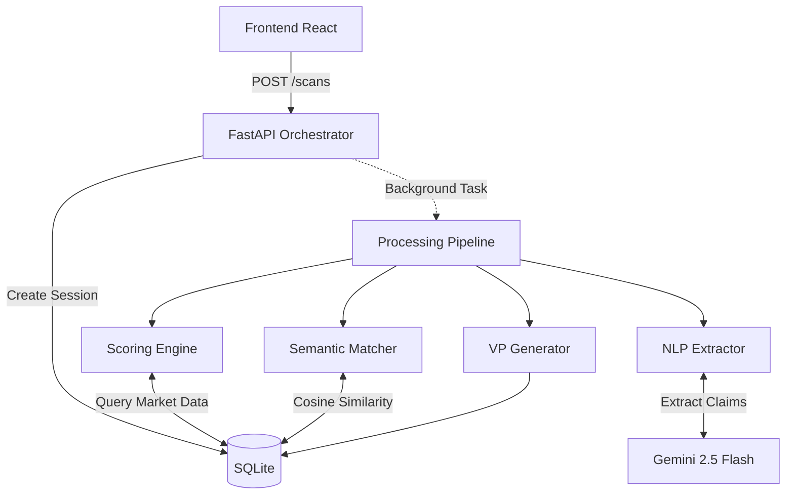

# System Architecture

ValueForge is built on a lightweight, modular architecture designed for rapid prototyping and demonstration, prioritizing instant analysis over enterprise-grade scale.

## High-Level Request Flow

The system operates as a synchronous-feeling, asynchronous-running web application:

1. **Frontend (React/Vite):** Collects the product concept (Name, Category, Persona, Primary Benefit, Key Ingredient, Price Tier) and submits via POST.
2. **FastAPI Backend:** Instantly creates a `ScanSession` in SQLite and returns the ID. It spins up a `BackgroundTask` to handle the heavy lifting.
3. **Frontend Polling:** Polling occurs every 1.5 seconds to track the granular status of the backend task.
4. **LLM Extraction (Gemini 2.5 Flash):** The backend sends the text benefit idea to Gemini to extract structured `claim_code` signals.
5. **Scoring Engine:** The extracted claims are evaluated against the seed database (SQLite) using our proprietary heuristics (see Scoring Formulas below).
6. **Semantic Matching:** The claims are embedded (via Gemini) and matched via cosine similarity against a curated Failure Case Library to surface relevant historical flops.
7. **Value Proposition Generation:** Finally, the system generates synthesized positioning cards based on the top whitespace opportunities.

---

## The 3-Dimension Whitespace Model & Scoring Formulas

At the core of ValueForge is the idea that true whitespace isn't just "what hasn't been done" — it requires Market Openness, Consumer Response, and Brand Permission.

### 1. Market Openness (Tier-CDS: Category Density Score)
Measures how saturated the specific price tier and category are with the proposed claim.
- **Formula:** `Base Density (0-100) - Penalty(High Price Tier)`
- **Heuristic:** We query the seed dataset for product counts. High counts result in high saturation (low Tier-CDS).
- **Buckets:**
  - `green` (Low saturation, high openness)
  - `yellow` (Moderate saturation)
  - `red` (High saturation / Contested)

### 2. Consumer Response Score (CRS)
Measures how the target persona reacts to the claim.
- **Components (weighted equally):**
  - **Believability:** Does the persona trust this claim?
  - **Relevance:** Does it solve a core need?
  - **Fatigue Inverse:** Have they seen this claim too much? (Inverted: High score = low fatigue).
  - **Trigger Alignment:** Does it align with their buying intent?
- **Formula:** Average of the 4 sub-scores. In the prototype, these are derived from a heuristic matrix mapping claims to personas.

### 3. Brand Permission Score (BPS)
Measures the brand's inherent credibility to make this claim, based on ingredients and product form.
- **Formula:** `Base Category-Claim Match Score + Ingredient Bonus`
- **Heuristic:** Certain ingredients (e.g., "Oats") grant massive permission to certain claims (e.g., "high_fiber"), boosting the BPS by up to 20 points.

### 4. Final Opportunity Score (FOS)
The synthesized score determining the rank of the opportunity.
- **Formula:** `(Tier-CDS * 0.3) + (CRS * 0.4) + (BPS * 0.3)`
- **Scale:** 0 to 100.

---

## Whitespace Classification Rules

Based on the intersection of the three dimensions, a claim is classified into one of five territories:

- **`true_whitespace`:** High Market Openness (Green) + High CRS (>75) + High BPS (>75). *The holy grail.*
- **`brand_whitespace`:** Low Market Openness (Red/Yellow) + High BPS (>75). *The market is crowded, but your brand can cut through because of strong permission.*
- **`consumer_whitespace`:** Low Market Openness (Red/Yellow) + High CRS (>75) + Low BPS. *Consumers want it, but the market is full and your brand isn't credible. Pivot required.*
- **`conditional`:** Moderate across the board. *Can be won with heavy marketing spend.*
- **`contested`:** High Saturation, Low Permission. *Avoid.*
